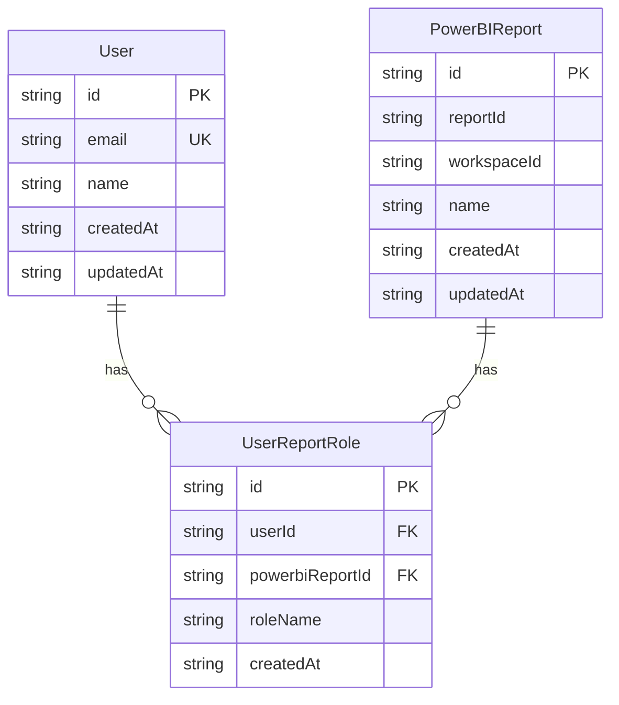
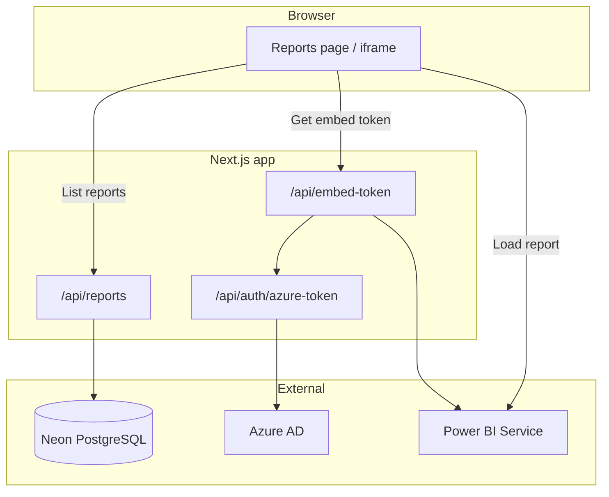
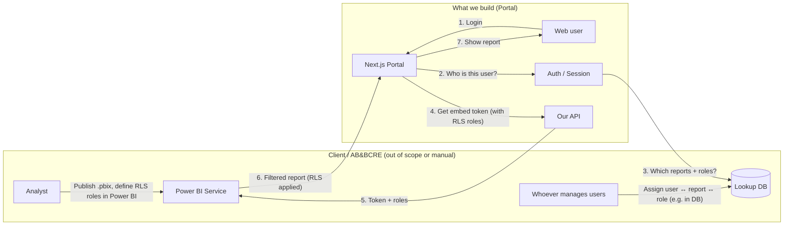
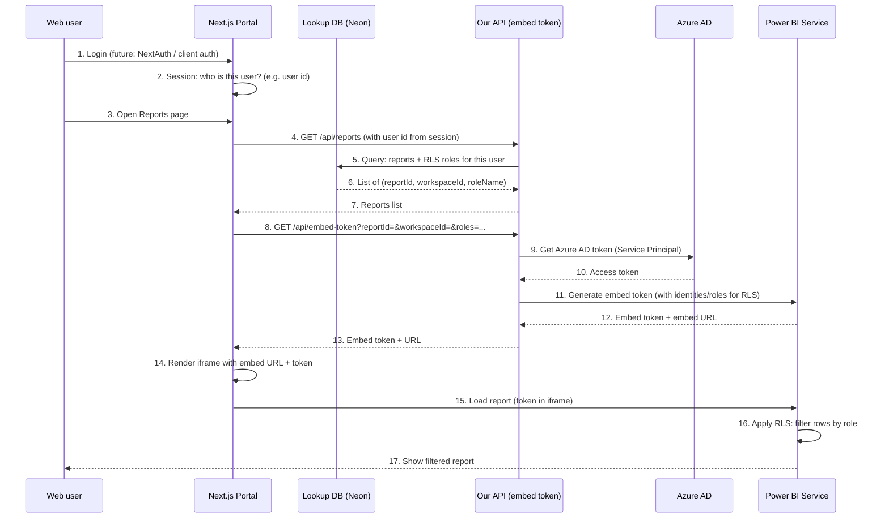
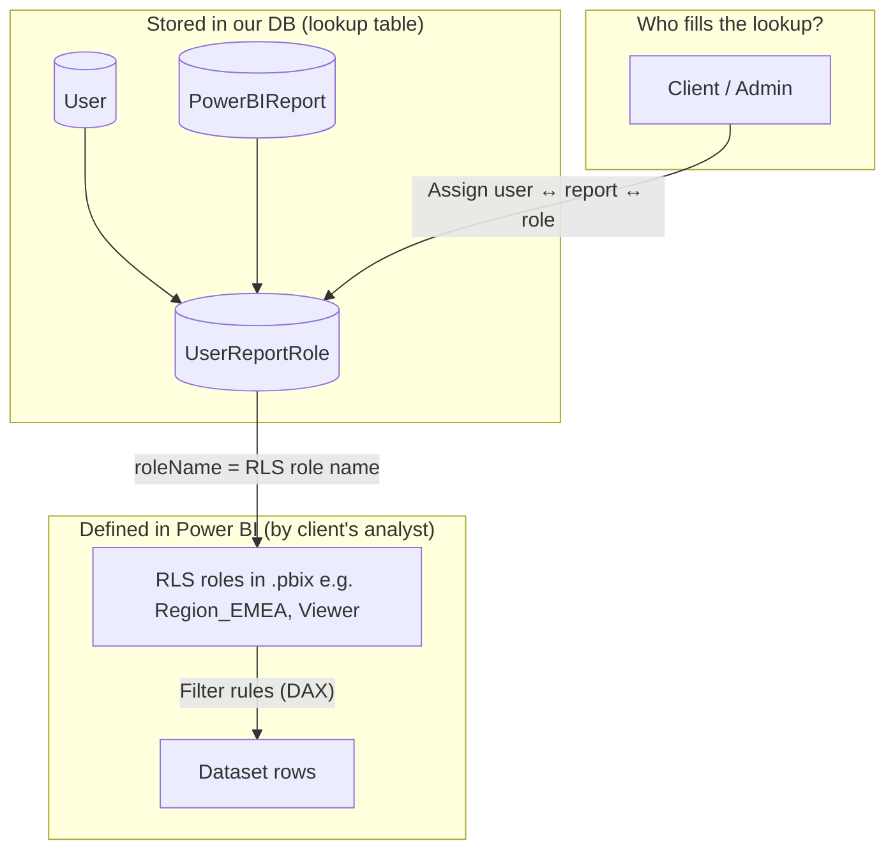
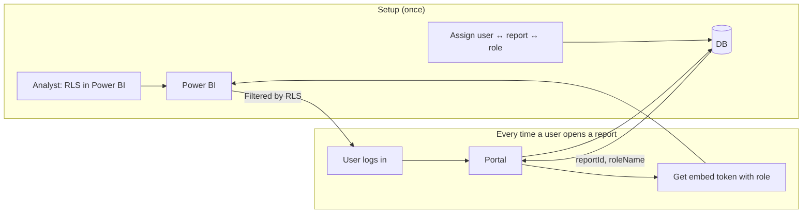

# How login, permissions & RLS work (per SOW)

Diagrams: **ER diagram** (database), **flowcharts**, and **sequence diagram**. Who logs in, who sets permissions, how RLS is used.

---

## 1. ER diagram — database (lookup tables)

**Relations:** One user can have many report-role assignments. One report can be assigned to many users (with same or different roles). `UserReportRole` is the lookup: “user X can see report Y with RLS role Z.”

---

## 2. System architecture flowchart

---

## 3. High-level: who does what

| Who | Responsibility |
|-----|----------------|
| **Client’s analyst** | Build reports in Power BI; define **RLS roles** in the .pbix (e.g. "Region_EMEA", "Viewer"). |
| **Whoever manages users** | Assign which **web user** can see which **report** and with which **role** (stored in our lookup DB; today can be manual/script, later optional admin UI). |
| **Web user** | Logs in to the portal and sees only the reports (and rows) they are allowed to see. |
| **Our portal** | Identifies the user, reads permissions from DB, requests embed token with the right RLS roles, and shows the report. |

---

## 4. End-to-end flow: login → report with RLS

So: **login** identifies the user, **DB** holds “who can see which report with which role”, **embed token** is requested with those **RLS roles**, and **Power BI** applies RLS and returns the filtered report.

---

## 5. Where permissions and RLS are set

- **RLS** = defined in Power BI (which role sees which rows). We never create or edit .pbix (out of scope).
- **Who sees which report and with which role** = stored in our DB (`User`, `PowerBIReport`, `UserReportRole`). Who fills that (manual, script, or future admin UI) is up to the client.

---

## 6. One-page overview (simplified)

---

## 7. Summary table (per SOW)

| What | Where | Who |
|------|--------|-----|
| **Who can log in** | Auth (future: NextAuth / client auth) | Web users (AB&BCRE’s users) |
| **Who can see which report** | Lookup DB (`UserReportRole`) | Set by client (manual/script or future admin) |
| **Which RLS role is used per user/report** | Same lookup (`UserReportRole.roleName`) | Same as above |
| **Definition of RLS (which rows each role sees)** | Power BI (.pbix) | Client’s analyst |
| **Applying RLS** | Power BI Service | We pass role names in embed token; Power BI filters rows |

---

*Diagrams use Mermaid. You can view them in GitHub, VS Code (with a Mermaid extension), or any Markdown viewer that supports Mermaid.*
